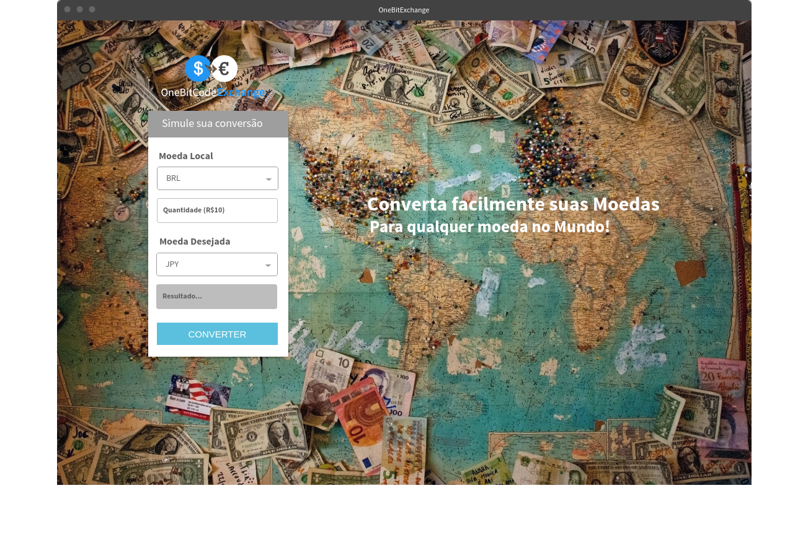

# Planejamento 
## Definição da ideia
- A definição da ideia é muito importante pra você ter clareza a todo momento de como desenvolver seu projeto, escrever uma frase que consiga explicar até mesmo para um leigo, rapidamento o que o seu projeto faz. Se você não consegue explicar o que seu projeto faz, talvez você precise melhorar o seu projeto. 
    
- Ex:  Realiza a conversão de uma quantidade X de uma moeda (exp BRL) em uma quantidade Y correspondente de outra (exp EUR). 
Stack do Projeto

## Stack do Projeto
	
- Desenvolvimento
	- Docker
	- Docker-Compose 
	- Ruby * Ruby On Rails
		- rest-client
		- webmock
	- Yarn
	- PostgreSql
- Deploy
	- Codeship
	- Heroku

## Mockup

- Link: https://onebitcode.com/wp-content/uploads/2018/06/mockup-onebitexchange.png

